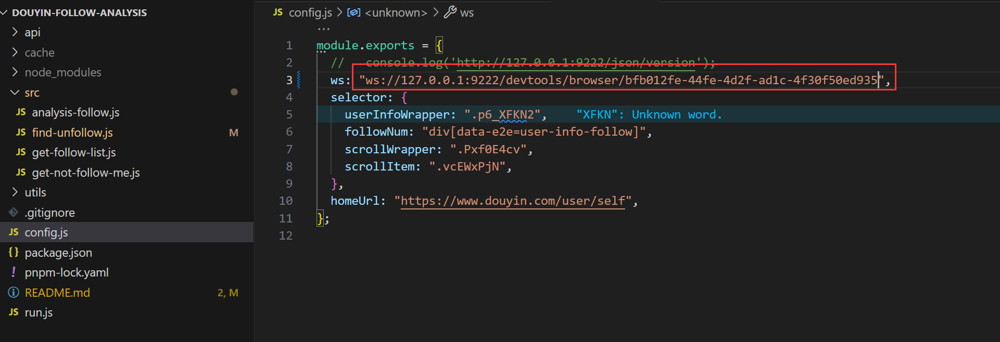

# puppeteer 抖音 node 脚本

爬取自己账号的粉丝列表，分析关注情况

## 使用说明

自己的谷歌浏览器先登录好抖音号

### cmd 启动调试浏览器

先关闭谷歌浏览器，打开调试版的谷歌浏览器

方式一：在命令行中执行

"C:\Program Files\Google\Chrome\Application\chrome.exe" --remote-debugging-port=9222

方式二：写在快捷方式的属性里的目标里面，写在目标里面 前面的双引号就不要了

C:\Program Files\Google\Chrome\Application\chrome.exe --remote-debugging-port=9222

进入调试版的谷歌浏览器，查看 ws 地址
<http://127.0.0.1:9222/json/version>

修改 config.js 里的 ws 地址

## puppeteer 方法

page.waitForSelector('selector') 等待对应的 dom 渲染完

page.evaluate(()=>{window 环境代码},params1:any)

page.$eval('selector', (el) => {})
